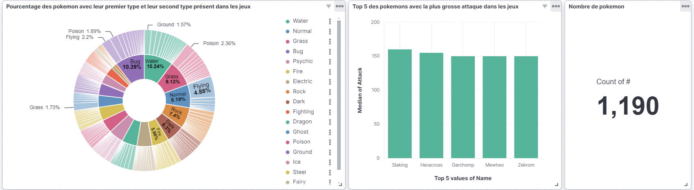
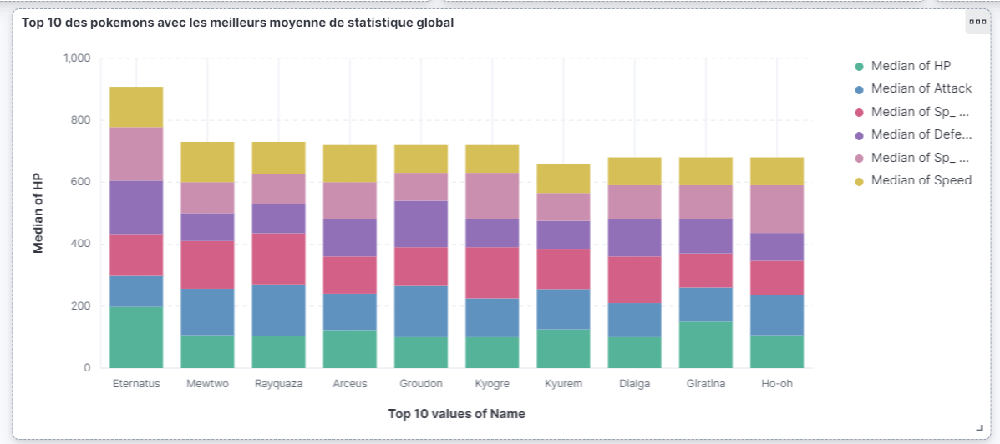

# Contexte
Nous devons créer un projet comprennant une partie web app et une partie API avec ElasticSearch.
Cette api a pour but d'alimenter le front Angular https://github.com/RemiLecas/ELK/tree/main
# Projet
## Description
Cette Api permet de faire des recherches ElasticSearch sur le cloud d'ElasticSearch

Lien du repository git : https://github.com/KenjiLAO/ElasticSearchBack

### Prérequis
Avoir Node.js d'installé :
https://nodejs.org/en

Installer les modules swaggers :
npm install swagger-jsdoc swagger-ui-express

Les dépendances s'installent localement automatiquement

### Lancement
npm start à partir de index.js pour lancer l'application

## Documentation

Après avoir lancé l'application, vous avez accès à cette endpoint :
http://localhost:3000/api-docs

Ce swagger montre tous les endpoints utilisés dans le front

## Dashboard

## Explication des différents données présentes dans le dashboard

Le tableau de bord présente une analyse des données des datasets de Pokémon présents dans ElasticSearch. Voici une vue d'ensemble des différents éléments :

- Répartition des types de Pokémon : Ce graphique en anneau permet de visualiser la répartition des Pokémon par type (Eau, Feu, etc.). De plus, il affiche les seconds types des Pokémon associés à chaque premier type.

- Top 5 des Pokémon avec la plus forte attaque : Ce graphique montre les Pokémon ayant les statistiques d'attaque les plus élevées dans les jeux.

- Nombre de Pokémon : Ce compteur indique le nombre total de Pokémon présents dans le dataset.

- Top 10 des Pokémon avec la meilleure moyenne de statistiques : Ce graphique montre les Pokémon ayant la meilleure moyenne de statistiques dans les jeux, tout en affichant leurs statistiques dans chaque domaine (attaque, défense, points de vie, etc.).